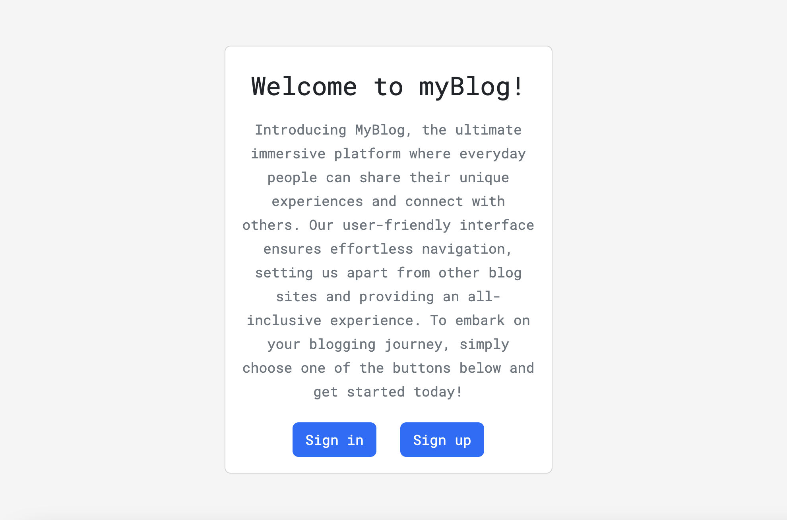

# myBlog

This is a CMS-style blog site that allows users to create, read, update and delete blog posts. It also allows users to add comments to existing blog posts. While also having the ability to authenticate the users that are logged in.

## Usage 
To instal the necessary dependencies run the following command: 

`npm install`

Next, sign into the MySQL shell using the following command:

`mysql -u root -p <your password>`

Create the database by using

`SOURCE ./schema.sql`

After creating the database, exit the MySQL shell and add seeds by running the following command:

`npm run test`

Finally, start the server

`npm run start`

once the server is started you will then be able to login and begin using the application. 

## Technologies Used 

This application runs on:
- node.js
- express.js 
- Sequelize
- MySQL2
- express-sessions
- connect-session-sequelize 
- Handlebars.js 
- dotenv
- bcrypt

This app is live on [Heroku](https://blog-site-141.herokuapp.com/).

# Questions?

If you have any questions or issues, please feel free to reach out to me via email at nortongage0@gmail.com or on [Github](https://github.com/Gatewayss?tab=repositories).

